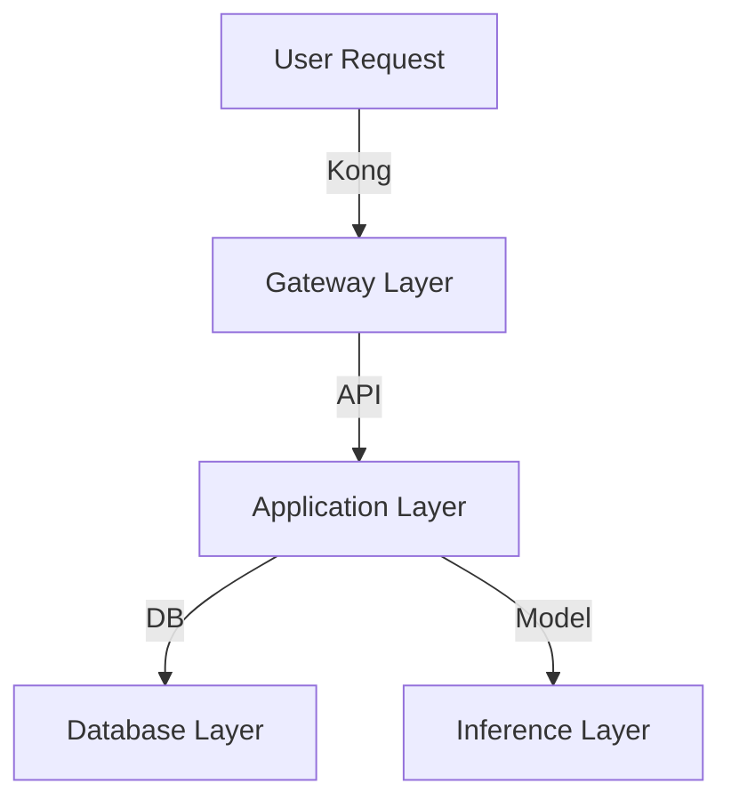

# Debug Latency Spike Playbook

## Table of Contents
1. [Overview](#overview)
2. [Component Identification](#component-identification)
3. [Prometheus Queries for Latency Breakdown](#prometheus-queries-for-latency-breakdown)
4. [Resource Saturation Diagnostics](#resource-saturation-diagnostics)
5. [Database Diagnostics](#database-diagnostics)
6. [Model Inference Diagnostics](#model-inference-diagnostics)
7. [Actionable Mitigation Steps](#actionable-mitigation-steps)
8. [Prevention](#prevention)

---

## Overview

This playbook guides you through diagnosing and resolving latency spikes in the AI Platform by systematically identifying the bottleneck component and applying targeted fixes.

### Latency SLA Thresholds

| Metric | Target | Warning | Critical |
|--------|--------|---------|----------|
| P50    | <200ms | >500ms  | >1s      |
| P95    | <500ms | >1s     | >2s      |
| P99    | <1s    | >1.5s   | >3s      |

### Symptoms

- P99 latency exceeds 1.5s
- User complaints about slow responses
- Timeout errors increasing
- Alert fired: `HighLatency` or `LatencySpike`

---

## Component Identification

### Step 1: Determine Which Component is Slow

Use this decision tree to identify the bottleneck:

```bash
# Check overall platform latency by service
histogram_quantile(0.95, rate(http_request_duration_seconds_bucket[5m])) by (job)
```

**Expected Response Times:**
- Kong Gateway: <50ms
- API Server: <200ms
- Database (Postgres): <100ms per query
- Model Inference: <500ms (Llama), <300ms (Qwen/DeepSeek)

### Step 2: Quick Component Health Check

```bash
# Kong Gateway health
curl -s http://localhost:8001/status | jq

# API Server health
curl -s http://localhost:8000/health | jq

# Postgres health
docker exec postgres pg_isready

# Qdrant health
curl -s http://localhost:6333/health | jq

# Model servers health
curl -s http://localhost:8080/health | jq  # Llama
curl -s http://localhost:8081/health | jq  # Qwen
curl -s http://localhost:8082/health | jq  # DeepSeek
```

### Step 3: Identify Latency Layer

**Kong vs API vs DB vs Model**



Run this sequence to isolate:

```bash
# 1. Kong latency (proxy overhead)
histogram_quantile(0.95, rate(kong_latency_bucket[5m]))

# 2. API latency (application logic)
histogram_quantile(0.95, rate(http_request_duration_seconds_bucket{job="api-server"}[5m]))

# 3. Database latency (query execution)
histogram_quantile(0.95, rate(pg_stat_statements_mean_exec_time_bucket[5m]))

# 4. Model latency (inference time)
histogram_quantile(0.95, rate(model_inference_duration_seconds_bucket[5m])) by (model)
```

---

## Prometheus Queries for Latency Breakdown

### Copy-Paste Ready Queries

All queries below are ready to paste into Prometheus UI (`http://localhost:9090/graph`) or Grafana.

#### Overall Platform Latency

```promql
# P95 latency across all services
histogram_quantile(0.95, rate(http_request_duration_seconds_bucket[5m]))
```

```promql
# P99 latency across all services
histogram_quantile(0.99, rate(http_request_duration_seconds_bucket[5m]))
```

```promql
# P50 (median) latency across all services
histogram_quantile(0.50, rate(http_request_duration_seconds_bucket[5m]))
```

#### Latency by Service

```promql
# P95 latency by service
histogram_quantile(0.95, rate(http_request_duration_seconds_bucket[5m])) by (job)
```

```promql
# Gateway latency breakdown
histogram_quantile(0.95, rate(http_request_duration_seconds_bucket{job="gateway"}[5m]))
```

```promql
# API Server latency breakdown
histogram_quantile(0.95, rate(http_request_duration_seconds_bucket{job="api-server"}[5m])) by (endpoint)
```

```promql
# Memory Service latency
histogram_quantile(0.95, rate(http_request_duration_seconds_bucket{job="memory-service"}[5m]))
```

```promql
# Learning Engine latency
histogram_quantile(0.95, rate(http_request_duration_seconds_bucket{job="learning-engine"}[5m]))
```

#### Model Inference Latency

```promql
# P95 model inference latency by model
histogram_quantile(0.95, rate(model_inference_duration_seconds_bucket[5m])) by (model)
```

```promql
# Llama 3.3 8B inference latency
histogram_quantile(0.95, rate(model_inference_duration_seconds_bucket{job="max-serve-llama"}[5m]))
```

```promql
# Qwen inference latency
histogram_quantile(0.95, rate(model_inference_duration_seconds_bucket{job="max-serve-qwen"}[5m]))
```

```promql
# DeepSeek inference latency
histogram_quantile(0.95, rate(model_inference_duration_seconds_bucket{job="max-serve-deepseek"}[5m]))
```

#### Database Latency

```promql
# Postgres query latency (avg)
rate(pg_stat_database_blks_read[5m]) / rate(pg_stat_database_xact_commit[5m])
```

```promql
# Qdrant search latency
histogram_quantile(0.95, rate(qdrant_request_duration_seconds_bucket{operation="search"}[5m]))
```

```promql
# Redis operation latency
histogram_quantile(0.95, rate(redis_command_duration_seconds_bucket[5m])) by (cmd)
```

#### Latency by Endpoint

```promql
# P95 latency by API endpoint
histogram_quantile(0.95, rate(http_request_duration_seconds_bucket{job="api-server"}[5m])) by (endpoint)
```

```promql
# Slowest endpoints (top 10)
topk(10, histogram_quantile(0.95, rate(http_request_duration_seconds_bucket[5m])) by (endpoint))
```

#### Time Series Analysis

```promql
# Latency trend over last 24 hours
histogram_quantile(0.95, rate(http_request_duration_seconds_bucket[5m]))
```

```promql
# Compare current vs 1 hour ago
(
  histogram_quantile(0.95, rate(http_request_duration_seconds_bucket[5m]))
  -
  histogram_quantile(0.95, rate(http_request_duration_seconds_bucket[5m] offset 1h))
)
```

```promql
# Latency rate of change (detect spikes)
deriv(histogram_quantile(0.95, rate(http_request_duration_seconds_bucket[5m]))[5m:1m])
```

---

## Resource Saturation Diagnostics

### CPU Saturation via cAdvisor Metrics

#### Copy-Paste Ready Queries

```promql
# CPU usage by container (percentage)
rate(container_cpu_usage_seconds_total{name!=""}[5m]) * 100
```

```promql
# Containers with CPU >80%
(rate(container_cpu_usage_seconds_total{name!=""}[5m]) * 100) > 80
```

```promql
# API Server CPU usage
rate(container_cpu_usage_seconds_total{name=~".*api-server.*"}[5m]) * 100
```

```promql
# Model server CPU usage
rate(container_cpu_usage_seconds_total{name=~".*max-serve.*"}[5m]) * 100 by (name)
```

```promql
# CPU throttling (indicator of saturation)
rate(container_cpu_cfs_throttled_seconds_total{name!=""}[5m])
```

```promql
# Containers being throttled >10% of time
(rate(container_cpu_cfs_throttled_seconds_total{name!=""}[5m]) / rate(container_cpu_cfs_periods_total{name!=""}[5m])) > 0.1
```

#### Manual Check via cAdvisor

```bash
# Check cAdvisor directly
curl -s http://localhost:8080/api/v1.3/docker/ | jq

# CPU usage for specific container
curl -s http://localhost:8080/api/v1.3/docker/api-server | jq '.cpu.usage'
```

### Memory Saturation via cAdvisor Metrics

#### Copy-Paste Ready Queries

```promql
# Memory usage by container (bytes)
container_memory_usage_bytes{name!=""}
```

```promql
# Memory usage by container (percentage of limit)
(container_memory_usage_bytes{name!=""} / container_spec_memory_limit_bytes{name!=""}) * 100
```

```promql
# Containers with memory >80% of limit
((container_memory_usage_bytes{name!=""} / container_spec_memory_limit_bytes{name!=""}) * 100) > 80
```

```promql
# API Server memory usage
container_memory_usage_bytes{name=~".*api-server.*"}
```

```promql
# Model server memory usage
container_memory_usage_bytes{name=~".*max-serve.*"} by (name)
```

```promql
# Memory pressure (OOM kills)
increase(container_memory_failcnt{name!=""}[5m])
```

```promql
# Working set memory (active memory)
container_memory_working_set_bytes{name!=""}
```

```promql
# Memory cache vs working set ratio
container_memory_cache{name!=""} / container_memory_working_set_bytes{name!=""}
```

#### Manual Check via cAdvisor

```bash
# Memory stats for all containers
curl -s http://localhost:8080/api/v1.3/docker/ | jq '.memory'

# Check for OOM events
docker inspect api-server | jq '.[0].State.OOMKilled'
```

### Network Saturation

```promql
# Network receive bytes per second
rate(container_network_receive_bytes_total{name!=""}[5m])
```

```promql
# Network transmit bytes per second
rate(container_network_transmit_bytes_total{name!=""}[5m])
```

```promql
# Network errors
rate(container_network_receive_errors_total{name!=""}[5m]) + rate(container_network_transmit_errors_total{name!=""}[5m])
```

### Disk I/O Saturation

```promql
# Disk read bytes per second
rate(container_fs_reads_bytes_total{name!=""}[5m])
```

```promql
# Disk write bytes per second
rate(container_fs_writes_bytes_total{name!=""}[5m])
```

```promql
# Disk I/O operations per second
rate(container_fs_reads_total{name!=""}[5m]) + rate(container_fs_writes_total{name!=""}[5m])
```

### GPU Utilization (NVIDIA)

```promql
# GPU utilization percentage
DCGM_FI_DEV_GPU_UTIL
```

```promql
# GPU memory usage
DCGM_FI_DEV_FB_USED / DCGM_FI_DEV_FB_FREE
```

```promql
# GPU temperature
DCGM_FI_DEV_GPU_TEMP
```

---

## Database Diagnostics

### Postgres Connection Pool Exhaustion

#### Check Connection Pool via Prometheus

```promql
# Active connections
pg_stat_database_numbackends{datname="ai_platform"}
```

```promql
# Total connections vs max
pg_stat_database_numbackends / pg_settings_max_connections
```

```promql
# Connections by state
pg_stat_activity_count by (state)
```

```promql
# Idle in transaction (potential leak)
pg_stat_activity_count{state="idle in transaction"}
```

```promql
# Connection pool exhaustion risk (>80% used)
(pg_stat_database_numbackends / pg_settings_max_connections) > 0.8
```

#### Check via pg_stat_activity

```bash
# Copy-paste ready: Show active connections by state
docker exec postgres psql -U ai_user -d ai_platform -c "
SELECT 
  state, 
  count(*) as count,
  max(now() - state_change) as max_age
FROM pg_stat_activity 
WHERE pid <> pg_backend_pid()
GROUP BY state
ORDER BY count DESC;
"
```

```bash
# Show connections waiting for locks
docker exec postgres psql -U ai_user -d ai_platform -c "
SELECT 
  pid,
  usename,
  application_name,
  client_addr,
  state,
  wait_event_type,
  wait_event,
  now() - state_change as wait_duration,
  query
FROM pg_stat_activity
WHERE wait_event IS NOT NULL
  AND pid <> pg_backend_pid()
ORDER BY wait_duration DESC
LIMIT 20;
"
```

```bash
# Show long-running queries (>5 seconds)
docker exec postgres psql -U ai_user -d ai_platform -c "
SELECT
  pid,
  now() - query_start AS duration,
  state,
  query
FROM pg_stat_activity
WHERE state <> 'idle'
  AND pid <> pg_backend_pid()
  AND now() - query_start > interval '5 seconds'
ORDER BY duration DESC;
"
```

```bash
# Show blocked queries
docker exec postgres psql -U ai_user -d ai_platform -c "
SELECT
  blocked_locks.pid AS blocked_pid,
  blocked_activity.usename AS blocked_user,
  blocking_locks.pid AS blocking_pid,
  blocking_activity.usename AS blocking_user,
  blocked_activity.query AS blocked_statement,
  blocking_activity.query AS blocking_statement,
  blocked_activity.application_name AS blocked_application
FROM pg_catalog.pg_locks blocked_locks
JOIN pg_catalog.pg_stat_activity blocked_activity ON blocked_activity.pid = blocked_locks.pid
JOIN pg_catalog.pg_locks blocking_locks ON blocking_locks.locktype = blocked_locks.locktype
  AND blocking_locks.database IS NOT DISTINCT FROM blocked_locks.database
  AND blocking_locks.relation IS NOT DISTINCT FROM blocked_locks.relation
  AND blocking_locks.page IS NOT DISTINCT FROM blocked_locks.page
  AND blocking_locks.tuple IS NOT DISTINCT FROM blocked_locks.tuple
  AND blocking_locks.virtualxid IS NOT DISTINCT FROM blocked_locks.virtualxid
  AND blocking_locks.transactionid IS NOT DISTINCT FROM blocked_locks.transactionid
  AND blocking_locks.classid IS NOT DISTINCT FROM blocked_locks.classid
  AND blocking_locks.objid IS NOT DISTINCT FROM blocked_locks.objid
  AND blocking_locks.objsubid IS NOT DISTINCT FROM blocked_locks.objsubid
  AND blocking_locks.pid <> blocked_locks.pid
JOIN pg_catalog.pg_stat_activity blocking_activity ON blocking_activity.pid = blocking_locks.pid
WHERE NOT blocked_locks.granted;
"
```

```bash
# Check connection pool configuration
docker exec postgres psql -U ai_user -d ai_platform -c "
SELECT 
  name, 
  setting, 
  unit, 
  short_desc
FROM pg_settings
WHERE name IN (
  'max_connections',
  'shared_buffers',
  'effective_cache_size',
  'work_mem',
  'maintenance_work_mem'
);
"
```

### Postgres Query Performance

```bash
# Top 10 slowest queries (requires pg_stat_statements)
docker exec postgres psql -U ai_user -d ai_platform -c "
SELECT
  substring(query, 1, 80) as short_query,
  calls,
  round(total_exec_time::numeric, 2) as total_time_ms,
  round(mean_exec_time::numeric, 2) as mean_time_ms,
  round(max_exec_time::numeric, 2) as max_time_ms,
  round((100 * total_exec_time / sum(total_exec_time) OVER ())::numeric, 2) as pct_total
FROM pg_stat_statements
ORDER BY mean_exec_time DESC
LIMIT 10;
"
```

```bash
# Cache hit ratio (should be >99%)
docker exec postgres psql -U ai_user -d ai_platform -c "
SELECT
  sum(heap_blks_read) as heap_read,
  sum(heap_blks_hit) as heap_hit,
  round(100 * sum(heap_blks_hit) / nullif(sum(heap_blks_hit) + sum(heap_blks_read), 0), 2) as cache_hit_ratio
FROM pg_statio_user_tables;
"
```

```bash
# Index usage statistics
docker exec postgres psql -U ai_user -d ai_platform -c "
SELECT
  schemaname,
  tablename,
  indexname,
  idx_scan as index_scans,
  idx_tup_read as tuples_read,
  idx_tup_fetch as tuples_fetched
FROM pg_stat_user_indexes
ORDER BY idx_scan DESC
LIMIT 20;
"
```

```bash
# Unused indexes (candidates for removal)
docker exec postgres psql -U ai_user -d ai_platform -c "
SELECT
  schemaname,
  tablename,
  indexname,
  idx_scan,
  pg_size_pretty(pg_relation_size(indexrelid)) as size
FROM pg_stat_user_indexes
WHERE idx_scan < 10
  AND indexrelname NOT LIKE '%pkey'
ORDER BY pg_relation_size(indexrelid) DESC;
"
```

### Qdrant Performance

```bash
# Qdrant collection stats
curl -s http://localhost:6333/collections | jq

# Specific collection info
curl -s http://localhost:6333/collections/documents | jq '.result | {
  points_count,
  segments_count,
  status,
  optimizer_status,
  vectors_count
}'
```

```promql
# Qdrant search latency
histogram_quantile(0.95, rate(qdrant_request_duration_seconds_bucket{operation="search"}[5m]))
```

### Redis Performance

```bash
# Redis stats
docker exec redis redis-cli INFO stats | grep -E "total_commands_processed|instantaneous_ops_per_sec|keyspace_hits|keyspace_misses"

# Cache hit ratio
docker exec redis redis-cli INFO stats | awk '/keyspace_hits|keyspace_misses/ {print}'
```

```promql
# Redis command latency
histogram_quantile(0.95, rate(redis_command_duration_seconds_bucket[5m])) by (cmd)
```

---

## Model Inference Diagnostics

### Model Inference Queue Depth

#### Prometheus Queries

```promql
# Inference queue depth (pending requests)
model_inference_queue_depth
```

```promql
# Inference queue depth by model
model_inference_queue_depth by (model)
```

```promql
# Llama queue depth
model_inference_queue_depth{job="max-serve-llama"}
```

```promql
# Qwen queue depth
model_inference_queue_depth{job="max-serve-qwen"}
```

```promql
# DeepSeek queue depth
model_inference_queue_depth{job="max-serve-deepseek"}
```

```promql
# Queue depth exceeding threshold (>10 requests)
model_inference_queue_depth > 10
```

```promql
# Inference requests waiting time
histogram_quantile(0.95, rate(model_inference_queue_wait_seconds_bucket[5m])) by (model)
```

### Model Server Performance

```promql
# Inference throughput (requests/sec)
rate(model_inference_requests_total[5m]) by (model)
```

```promql
# Inference errors
rate(model_inference_errors_total[5m]) by (model, error_type)
```

```promql
# Model server concurrent requests
model_inference_concurrent_requests by (model)
```

```promql
# Tokens per second (generation speed)
rate(model_tokens_generated_total[5m]) / rate(model_inference_requests_total[5m])
```

```promql
# TTFT - Time to First Token (P95)
histogram_quantile(0.95, rate(model_time_to_first_token_seconds_bucket[5m])) by (model)
```

```promql
# TPOT - Time per Output Token (P95)
histogram_quantile(0.95, rate(model_time_per_output_token_seconds_bucket[5m])) by (model)
```

### Manual Model Server Checks

```bash
# Check Llama server metrics
curl -s http://localhost:8080/metrics | grep -E "queue_depth|concurrent|latency"

# Check Qwen server metrics
curl -s http://localhost:8081/metrics | grep -E "queue_depth|concurrent|latency"

# Check DeepSeek server metrics
curl -s http://localhost:8082/metrics | grep -E "queue_depth|concurrent|latency"
```

```bash
# Test inference latency directly
time curl -X POST http://localhost:8080/v1/completions \
  -H "Content-Type: application/json" \
  -d '{
    "prompt": "Test prompt",
    "max_tokens": 100,
    "temperature": 0.7
  }'
```

### GPU Utilization for Model Inference

```promql
# GPU utilization during inference
DCGM_FI_DEV_GPU_UTIL{pod=~".*max-serve.*"}
```

```promql
# GPU memory usage during inference
DCGM_FI_DEV_FB_USED{pod=~".*max-serve.*"} / 1024 / 1024 / 1024
```

```promql
# GPU temperature
DCGM_FI_DEV_GPU_TEMP{pod=~".*max-serve.*"}
```

```bash
# Check GPU via nvidia-smi
docker exec max-serve-llama nvidia-smi
```

---

## Actionable Mitigation Steps

### Root Cause: Kong Gateway Latency

**Symptoms:**
- High `kong_latency` metric
- Gateway CPU >80%
- Request rate limit errors

**Immediate Actions:**

```bash
# 1. Scale Kong horizontally
docker compose up -d --scale kong=3

# 2. Increase Kong worker processes
# Edit docker-compose.yml: KONG_NGINX_WORKER_PROCESSES=auto
docker compose up -d kong

# 3. Enable Kong caching (if not enabled)
curl -X POST http://localhost:8001/plugins \
  -d "name=proxy-cache" \
  -d "config.strategy=memory" \
  -d "config.memory.dictionary_name=kong_cache"

# 4. Adjust rate limits if too aggressive
curl -X PATCH http://localhost:8001/plugins/<rate-limit-plugin-id> \
  -d "config.minute=1000"
```

**Long-term Solutions:**
- Implement Kong clustering for high availability
- Use Redis for distributed caching
- Enable request coalescing for duplicate requests
- Optimize Kong plugins (disable unused ones)

---

### Root Cause: API Server Application Latency

**Symptoms:**
- High `http_request_duration_seconds` for API server
- API CPU >80%
- Slow endpoint-specific latency

**Immediate Actions:**

```bash
# 1. Scale API server horizontally
docker compose up -d --scale api-server=5

# 2. Increase worker processes/threads
# Edit docker-compose.yml: UVICORN_WORKERS=8
docker compose up -d api-server

# 3. Enable response caching
curl -X POST http://localhost:8000/admin/cache/enable

# 4. Increase request timeout (temporary)
# Edit docker-compose.yml: REQUEST_TIMEOUT=60
docker compose up -d api-server

# 5. Profile the application
docker exec api-server python -m cProfile -o /tmp/profile.prof app.py
```

**Long-term Solutions:**
- Optimize slow endpoints (use profiling data)
- Implement async processing for slow operations
- Add caching layer (Redis) for expensive computations
- Optimize database queries (see below)
- Implement pagination for large result sets

---

### Root Cause: Postgres Database Latency

**Symptoms:**
- High `pg_stat_statements_mean_exec_time`
- Postgres CPU >80%
- Connection pool exhaustion (`pg_stat_activity` shows high connection count)

**Immediate Actions:**

```bash
# 1. Kill long-running queries
docker exec postgres psql -U ai_user -d ai_platform -c "
SELECT pg_terminate_backend(pid)
FROM pg_stat_activity
WHERE pid <> pg_backend_pid()
  AND state <> 'idle'
  AND now() - query_start > interval '30 seconds';
"

# 2. Increase connection pool size
# Edit docker-compose.yml or API server config:
# DB_POOL_SIZE=50
# DB_MAX_OVERFLOW=20
docker compose up -d api-server

# 3. Increase Postgres max_connections
docker exec postgres psql -U ai_user -d ai_platform -c "
ALTER SYSTEM SET max_connections = 200;
SELECT pg_reload_conf();
"

# 4. Add missing index (example)
docker exec postgres psql -U ai_user -d ai_platform -c "
CREATE INDEX CONCURRENTLY idx_users_email ON users(email);
"

# 5. Vacuum bloated tables
docker exec postgres psql -U ai_user -d ai_platform -c "
VACUUM ANALYZE;
"

# 6. Enable read replicas (if configured)
# Route read queries to replica
# Edit API server config: DB_READ_REPLICA_URL=...
```

**Long-term Solutions:**
- Optimize slow queries (use `EXPLAIN ANALYZE`)
- Add proper indexes for frequently queried columns
- Implement connection pooling with PgBouncer
- Set up read replicas for read-heavy workloads
- Partition large tables
- Implement query result caching
- Tune Postgres configuration (shared_buffers, work_mem, etc.)

---

### Root Cause: Qdrant Vector Database Latency

**Symptoms:**
- High `qdrant_request_duration_seconds`
- Slow vector search operations
- Qdrant CPU/memory >80%

**Immediate Actions:**

```bash
# 1. Optimize HNSW index
curl -X POST http://localhost:6333/collections/documents/index \
  -H "Content-Type: application/json" \
  -d '{"operation": "optimize"}'

# 2. Reduce search accuracy for speed (temporary)
# Decrease ef parameter in search requests
curl -X POST http://localhost:6333/collections/documents/points/search \
  -H "Content-Type: application/json" \
  -d '{
    "vector": [...],
    "limit": 10,
    "params": {
      "hnsw_ef": 64
    }
  }'

# 3. Enable Qdrant caching
# Edit qdrant config: cache_size_mb=1024

# 4. Scale Qdrant (if using cluster mode)
docker compose up -d --scale qdrant=3
```

**Long-term Solutions:**
- Optimize HNSW parameters (ef_construct, m)
- Use quantization to reduce memory usage
- Implement result caching for common queries
- Shard collections across multiple Qdrant instances
- Use payload filtering efficiently (indexed fields)

---

### Root Cause: Model Inference Latency

**Symptoms:**
- High `model_inference_duration_seconds`
- High `model_inference_queue_depth` (>10)
- GPU utilization 100%
- Slow TTFT or TPOT

**Immediate Actions:**

```bash
# 1. Scale model servers horizontally (add GPU instances)
# Note: Requires additional GPU resources
docker compose up -d --scale max-serve-llama=2

# 2. Reduce max_batch_size for lower latency
# Edit model server config: MAX_BATCH_SIZE=4
docker compose up -d max-serve-llama

# 3. Implement request queuing with priority
# Route urgent requests to dedicated instance

# 4. Reduce max_tokens for requests
# Client-side: limit max_tokens to 512 instead of 2048

# 5. Enable KV cache optimization
# Edit model server config: USE_KV_CACHE=true

# 6. Switch to faster model (temporary)
# Route to Qwen/DeepSeek instead of Llama for non-critical requests
```

**Long-term Solutions:**
- Implement model quantization (INT8/INT4) for faster inference
- Use speculative decoding for faster generation
- Implement continuous batching (vLLM/TensorRT-LLM)
- Add more GPU capacity
- Implement request prioritization and queuing
- Use model caching for common prompts
- Optimize model configuration (temperature, top_p, etc.)
- Implement early stopping for generated responses

---

### Root Cause: Memory Saturation

**Symptoms:**
- `container_memory_usage_bytes` >80% of limit
- OOM kills (`container_memory_failcnt`)
- High GC pauses (for Python/Java services)

**Immediate Actions:**

```bash
# 1. Increase memory limits
docker compose up -d --scale api-server=0
# Edit docker-compose.yml: 
#   deploy.resources.limits.memory: 4G
docker compose up -d api-server

# 2. Restart containers to clear memory leaks
docker compose restart api-server

# 3. Clear application caches
curl -X POST http://localhost:8000/admin/cache/clear

# 4. Reduce model batch size (for model servers)
# Edit model config: MAX_BATCH_SIZE=2
docker compose up -d max-serve-llama
```

**Long-term Solutions:**
- Fix memory leaks in application code
- Implement proper cache eviction policies
- Tune garbage collection (Python: gc module)
- Optimize data structures (use generators, iterators)
- Implement memory profiling and monitoring

---

### Root Cause: CPU Saturation

**Symptoms:**
- `container_cpu_usage_seconds_total` >80%
- High `container_cpu_cfs_throttled_seconds_total`
- Slow request processing

**Immediate Actions:**

```bash
# 1. Increase CPU limits
# Edit docker-compose.yml:
#   deploy.resources.limits.cpus: "4"
docker compose up -d api-server

# 2. Scale horizontally
docker compose up -d --scale api-server=5

# 3. Reduce workload (temporary rate limiting)
curl -X POST http://localhost:8001/plugins \
  -d "name=rate-limiting" \
  -d "config.minute=500"
```

**Long-term Solutions:**
- Optimize CPU-intensive operations
- Implement caching to reduce computation
- Use async/await properly (avoid blocking)
- Profile and optimize hot code paths

---

### Root Cause: Network Saturation

**Symptoms:**
- High `container_network_receive_bytes_total`
- Network errors increasing
- Slow inter-service communication

**Immediate Actions:**

```bash
# 1. Enable response compression
# Edit API server config: ENABLE_GZIP=true
docker compose up -d api-server

# 2. Reduce payload sizes
# Implement pagination, field filtering

# 3. Use local caching to reduce network calls
curl -X POST http://localhost:8000/admin/cache/enable
```

**Long-term Solutions:**
- Implement gRPC instead of HTTP/JSON for inter-service
- Use CDN for static assets
- Optimize data transfer formats (protobuf, msgpack)
- Implement request batching

---

## Prevention

### Monitoring and Alerting

**Prometheus Alert Rules:**

```yaml
groups:
  - name: latency_alerts
    interval: 30s
    rules:
      - alert: LatencyP99High
        expr: histogram_quantile(0.99, rate(http_request_duration_seconds_bucket[5m])) > 1.5
        for: 5m
        labels:
          severity: warning
        annotations:
          summary: "P99 latency exceeds 1.5s"
          description: "P99 latency is {{ $value }}s for {{ $labels.job }}"

      - alert: LatencyP99Critical
        expr: histogram_quantile(0.99, rate(http_request_duration_seconds_bucket[5m])) > 3.0
        for: 2m
        labels:
          severity: critical
        annotations:
          summary: "P99 latency exceeds 3s"
          description: "P99 latency is {{ $value }}s for {{ $labels.job }}"

      - alert: ModelQueueDepthHigh
        expr: model_inference_queue_depth > 10
        for: 5m
        labels:
          severity: warning
        annotations:
          summary: "Model inference queue depth exceeds 10"
          description: "Queue depth is {{ $value }} for {{ $labels.model }}"

      - alert: PostgresConnectionPoolExhaustion
        expr: (pg_stat_database_numbackends / pg_settings_max_connections) > 0.8
        for: 5m
        labels:
          severity: warning
        annotations:
          summary: "Postgres connection pool >80% utilized"
          description: "Connection pool is {{ $value | humanizePercentage }} utilized"

      - alert: CPUSaturation
        expr: (rate(container_cpu_usage_seconds_total[5m]) * 100) > 80
        for: 5m
        labels:
          severity: warning
        annotations:
          summary: "Container CPU >80%"
          description: "CPU usage is {{ $value }}% for {{ $labels.name }}"

      - alert: MemorySaturation
        expr: ((container_memory_usage_bytes / container_spec_memory_limit_bytes) * 100) > 80
        for: 5m
        labels:
          severity: warning
        annotations:
          summary: "Container memory >80%"
          description: "Memory usage is {{ $value }}% for {{ $labels.name }}"
```

### Load Testing

```bash
# Regular load tests to establish baselines
k6 run --vus 100 --duration 300s tests/load/k6_load_test.js

# Stress testing before releases
k6 run --vus 500 --duration 600s tests/load/k6_stress_test.js
```

### Performance Budgets

- **P50 latency**: <200ms
- **P95 latency**: <500ms
- **P99 latency**: <1s
- **Database query time**: <100ms
- **Model inference**: <500ms (Llama), <300ms (Qwen/DeepSeek)
- **CPU usage**: <70% average
- **Memory usage**: <70% average
- **Connection pool**: <60% utilized

### Code Review Checklist

- [ ] No blocking I/O in async code
- [ ] Database queries use proper indexes
- [ ] Pagination implemented for large result sets
- [ ] Response compression enabled
- [ ] Caching strategy implemented
- [ ] Timeouts configured for all external calls
- [ ] Connection pooling properly configured
- [ ] Load tested under expected peak traffic
- [ ] Prometheus metrics instrumented
- [ ] Circuit breakers configured for external dependencies

---

**Version**: 2.0  
**Last Updated**: 2025-01-30  
**Owner**: SRE Team  
**Next Review**: 2025-02-28
